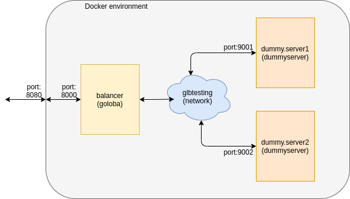

# GoLoBa - Go(lang) Load Balancer

Implementation of a simple load balancer for TCP connections.

## Introduction

**goloba** is a simple example of *Layer 4 balancer* working in *proxy mode*. Each connection established with **goloba** process is forwarded to one of configured endpoints. Endpoint selection is made internally based on implemented balancing algorithm (currently it's only *round robin*).

Load balancer listening port and list of endpoints (address:port pairs) are provided in configuration file or through system environment variables. Please check [Usage](#usage) section for more details.

**goloba** is a demonstration of load balancing idea rather than complete, highly efficient solution and so it is not suggested to use it in any production environment.

Together with **goloba** another application, **dummyserver**, is provided. This app is a very simple HTTP server that prints a welcome message. Both listetening port and message printed are configurable. More information in [Usage](#usage) section.

## Downloading and building

GoLoBa project is created as an Go module with Makefile provided so can be downloaded by *git clone* to any location and compiled by simple *make*:

```bash
git clone github.com/markamdev/goloba
cd goloba
make
```

Output binaries (**goloba** and **dummyserver**) and sample configuration file will be placed inside *./build* directory. Application usage can be found in [Usage](#usage) section while testing process is described in [Testing](#testing).

## Usage

### goloba params and environment variables

When launching **goloba** following commandline params and system environment variables can be specified:

| Flag | Env var | Param | Description |
|------|---------|-------|-------------|
| TODO | TODO | TODO | TODO |

### goloba.conf example

**! OBSOLETE !**

Currently **goloba** accepts configuration file in *json* format. Sample file content is shown below:

```json
{
    "port" : 7080,
    "servers" : [ "localhost:8080" , "localhost:9000"]
}
```

*port* parameter in sample above defines **goloba** listening port as a single integer value.

*servers* is an array of string containing supported (*balanced*) servers in form *address:port*.

### dummyserver params  and environment variables

**dummyserver** can be configured using command line params and system environment variables while variables have higher priority (importance).

Accepted command line parameters and related environment variable:


| Flag | Env var | Param | Description |
|------|---------|-------|-------------|
| port | PORT | \<port\> | Listening port number (9000 by default) |
| message | MESSAGE | \<message\> | Message sent to client in HTML content |

## Docker container and docker-compose testbench

As this repository contains two applications there are also two docker files and two Docker images that can be built. Dockerfiles for **goloba** and **dummyserver** are named *Dockerfile.goloba* and *Dockerfile.dummyserver* respectively.

Both images can be build using single `make docker` command (if Docker is installed on the machine). Output images will be *markamdev/goloba* and *markamdev/dummyserver*.

There's also simple testbench prepared to be launched in Docker Compose tool. Testbench is described in *docker-compose.yml* and contains two **dummyserver** instances accessible through one **goloba**. After launching testbench by `docker-compose up -d` environment can be accessed using local port *8080*.

Diagram below presents testbench configuration:



## Testing

To Be Done...

## Licensing

Code is published under [MIT License](https://opensource.org/licenses/MIT) as it seems to be the most permissive license. If for some reason you need to have this code published with other license (ex. to reuse the code in your project) please contact [author](#author-/-contact) directly.

## Author / Contact

If you need to contact me feel free to write me an email:
[markamdev.84#dontwantSPAM#gmail.com](mailto:)
